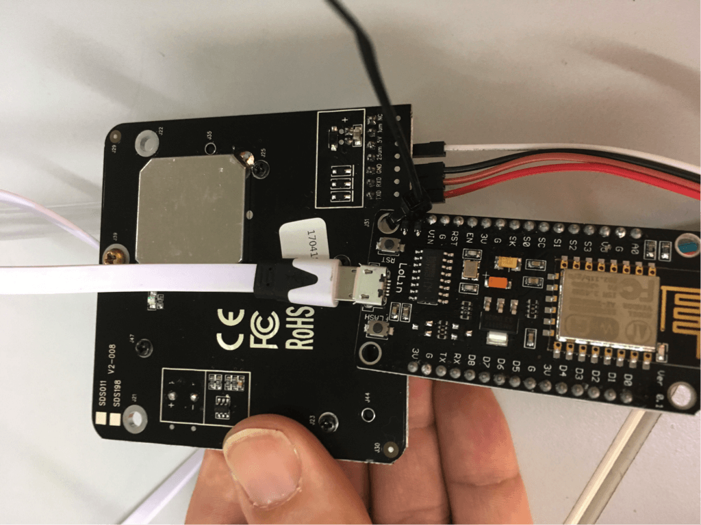
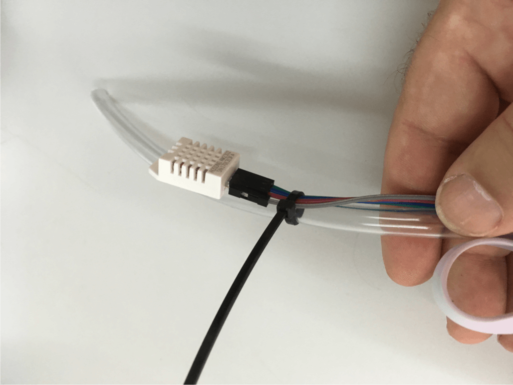
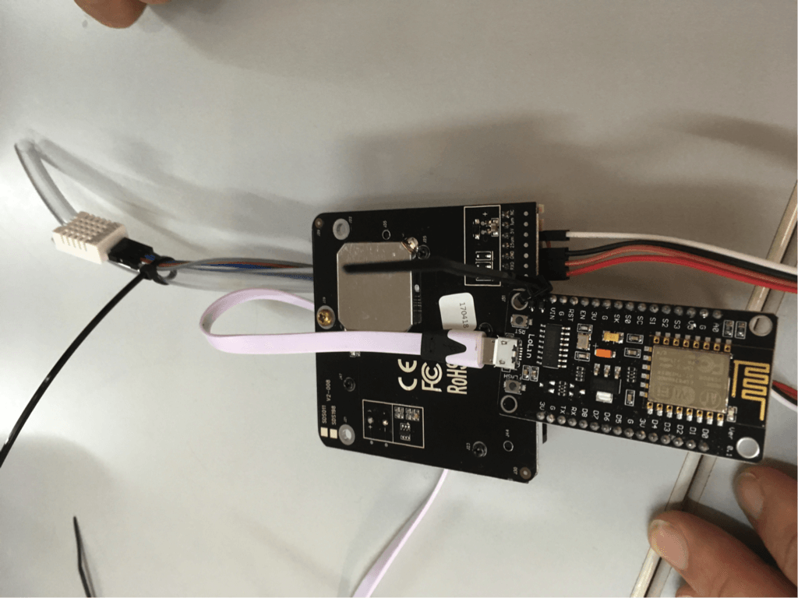
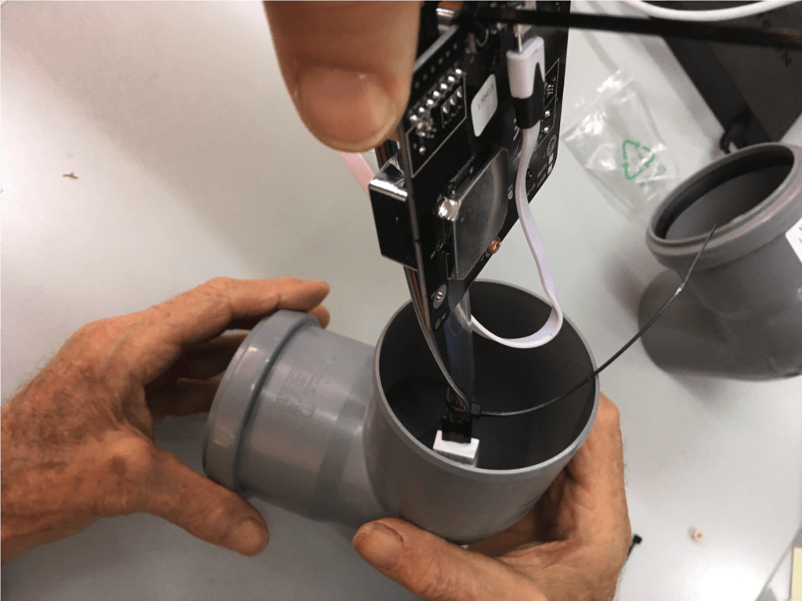
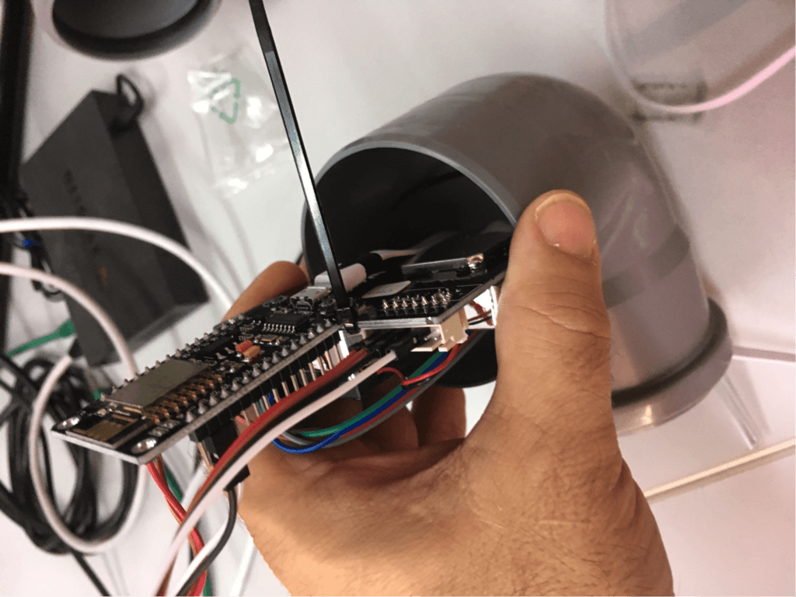

> ⚠️ **IMPORTANT NOTE**
Before assembling install the firmware!
See import [firmware section](/guide/firmware/).

### NodeMCU v2
Note: Our instructions refer to version 3 of the NodeMCU. This can be recognized by the connections VU and G (see drawing). The versions have RSV at these ports. In these versions, the VIN ports can be used instead of VU and GND instead of G next to the MicroUSB port.

#### Connection SDS011 for NodeMCU v2
Pins are numbered from RIGHT to LEFT, make sure when connecting that the cables are sitting on the pins, as most Dupont cables also fit inbetween the pins.

```bash
SDS011 Pin 1 -> Pin D1 / GPIO5
SDS011 Pin 2 -> Pin D2 / GPIO4
SDS011 Pin 3 -> GND
SDS011 Pin 4 -> unused
SDS011 Pin 5 -> VU (NodeMCU v3) / VIN (NodeMCU v1,v2)
SDS011 Pin 6 -> unused
SDS011 Pin 7 -> unused
```

#### Connecting DHT22 for NodeMCU v2
Pins are numbered from LEFT to RIGHT.
```bash
DHT22 Pin 1 -> Pin 3V3 (3.3V)
DHT22 Pin 2 -> Pin D7 (GPIO13)
DHT22 Pin 3 -> unused
DHT22 Pin 4 -> Pin GND
Electronic switch
```


### NodeMCU v3
Note: Our instructions refer to version 3 of the NodeMCU. This can be recognized by the connections VU and G (see drawing). The versions have RSV at these ports. In these versions, the VIN ports can be used instead of VU and GND instead of G next to the MicroUSB port.

#### Connection SDS011
Pins are numbered from RIGHT to LEFT, make sure when connecting that the cables are sitting on the pins, as most Dupont cables also fit inbetween the pins.
```bash
SDS011 Pin 1 -> Pin D1 / GPIO5
SDS011 Pin 2 -> Pin D2 / GPIO4
SDS011 Pin 3 -> GND
SDS011 Pin 4 -> unused
SDS011 Pin 5 -> VU (NodeMCU v3) / VIN (NodeMCU v1,v2)
SDS011 Pin 6 -> unused
SDS011 Pin 7 -> unused
```


#### Connecting DHT22
Pins are numbered from LEFT to RIGHT.
```bash
DHT22 Pin 1 -> Pin 3V3 (3.3V)
DHT22 Pin 2 -> Pin D7 (GPIO13)
DHT22 Pin 3 -> unused
DHT22 Pin 4 -> Pin GND
```

### Electronic switch
The particulate matter sensor SDS011 and the temperature and humidity sensor DHT22 are connected with cables to the chip (NodeMCU).

### Connecting displays and other sensors
In the FAQ, under ‘Connecting other sensors’, there is a list of supported sensors (such as BME280) and displays. It is also described how to connected those.


### Finalize

#### Tie everything together
Tie NodeMCU (ESP8266) and SDS011 fine dust sensor together with a cable tie. Point the Wifi antenna away from the sensor (see picture).



Tie the temperature sensor DHT22 to the tube with another cable tie.




Pull the USB cable through the pipe.



Install the SDS011 particutal matter board. The fan is pointing down.
Push parts into the pipe,  so that the sensor fixates in the pipe.




Tube and USB cable should be looking out of the pipe.
Connect the second Pipe. Make sure that no cables are pinched.
Position the temperature sensor at the end, so it still sits inside the pipe.
Cut the transparent tube. Close the open ends of the pipes with a net or similar, so that the air can circulate but insects stay outside.


